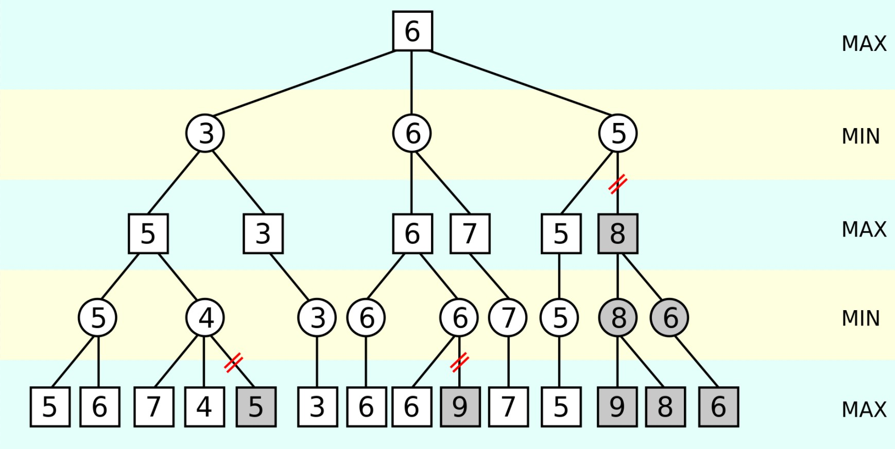
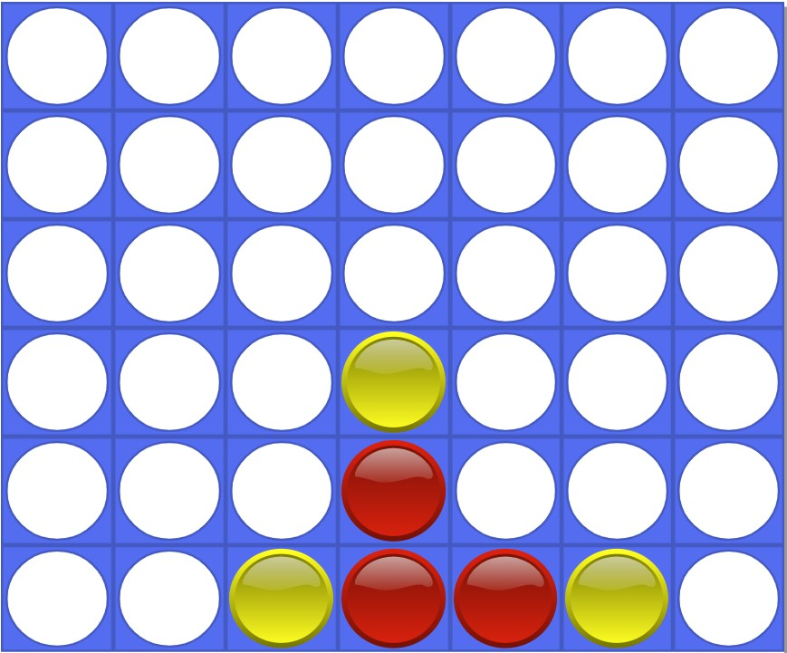

# 🎲 Connect 4 Web 🎲
This project was inspired by the Intro to AI course I took online offered by <a href="https://online-learning.harvard.edu/course/cs50s-introduction-artificial-intelligence-python?delta=0">Harvard</a>. Simply enough, it is an algorithm that I implemented to basically win every game of connect 4. Feel free to try and beat it <a href="https://kushbhag.github.io/Connect4Web/">here</a>, and if you do, email me with a screenshot and I'll buy you a cookie 🍪.

## How it works?
The main algorithm used for this project is a depth limited <a href="https://en.wikipedia.org/wiki/Minimax">minimax algorithm</a>. To put in to layman's terms, the algorithm creates a search tree given the state of the board, for all possible moves that it could make, it then repeats this process for (a depth of) 5 times, at which point it will try to determine the best move out of all possible moves and then play it.

---

### Minimax
So where does minimax come into play? Essentially every move that the AI can make is scored based on how close making that move would help it to win the game. The goal of the minimax algorithm is to figure out the 'maximin' move, which is mathematically the highest valued move that the player make without losing the game. Honestly, explaining the algorithm it kind of redundant, because wikipedia does it like 100x better than I ever can, so if you really want to know how the algoirthm works, just click <a href="https://en.wikipedia.org/wiki/Minimax">here</a>.

---

### Scoring
As I mentioned above, the algorithm needs to score the board based on how much it helps the player to win the game. The scoring strategy that I used was to parse through all possible combinations of 4-horizontals, 4-verticals, and 4-diagonals, and count the number of tokens there were in each combination. The more tokens of my player there were, the higher the score would be, the higher the opponents tile count is, the lower the score would be.

So something like this might be worth a considerate amount because there are not opponent pieces that are there.

In comparison to something like this, this is a high scoring move, and would be weighed a lot more.

The last example here is worth the exact same as the first one, because this didn't end up in a win, but it still added decent pressure to the opponent. The way I perceive it, an algorithm wouldn't want to get to a move like this, because I would rather it win, then get blocked, which is why it is relatively low scoring. A full 4 in a row is worth a huge number of points, so that it becomes the most attractive move out of the bunch.

---

### Optimizations
Once scoring was done, and the minimax algorithm was implemented, I felt like it would help out by pruning certain searches, as they might be redundant. The two specific optimizations I implemented were <a href="https://en.wikipedia.org/wiki/Alpha%E2%80%93beta_pruning">alpha-beta pruning</a> and <a href="https://en.wikipedia.org/wiki/Transposition_table">transposition tables</a>

#### Alpha-Beta Pruning
This process is usually found with many minimax algorithms, because it reduces the search time by a lot.

Based on whether or not the algorithm is trying to maximize it's score or minimize it's score, the algorithm can selectively decide to ignore certain branches. Consider the right most example where the branch going to 8 was ignored, and didn't continue it's search. Because the row above it was trying to minimize it's score, it already had a score of 5 from it's left branch, and therefore going to right branch, which we already evaluated some of it's value to be 8, would just be redundant because 5 < 8. Simply speaking, not matter what search we do in the right branch, and no matter what number 'x' we pull from it, 5 < 8 <= x, and because we are trying to minimize our score, we would always select the branch with the score of 5.

#### Transposition tables
When trying to parse through all possible moves within the board for 5 moves into the future, there are bound to be certain moves that are ambiguous. In other words, there can be multiple ways in which you can get to the board below...

The first time I get to that configuration, I run through the minimax algorithm, and then assign a score to the board. If I come back to that same configuration a second time, there would be no point in repeating the same process I did before. Therefore, once I visit a board state, I store it's value in a transposition table, and then check back with it before making a move, not performing the algorithm if I had already done so previously.
